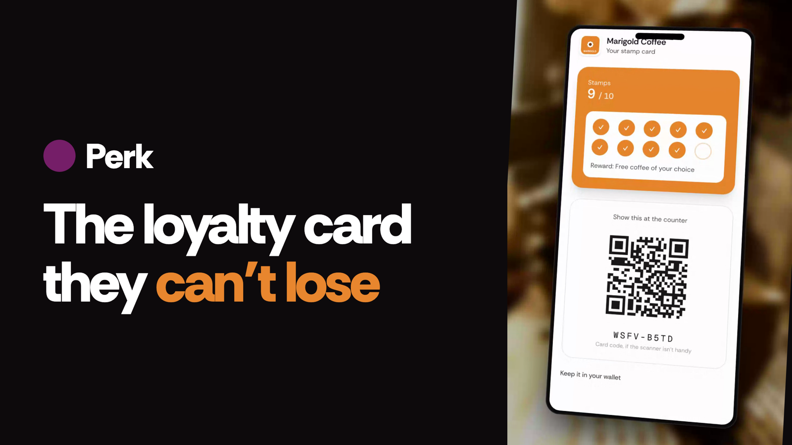
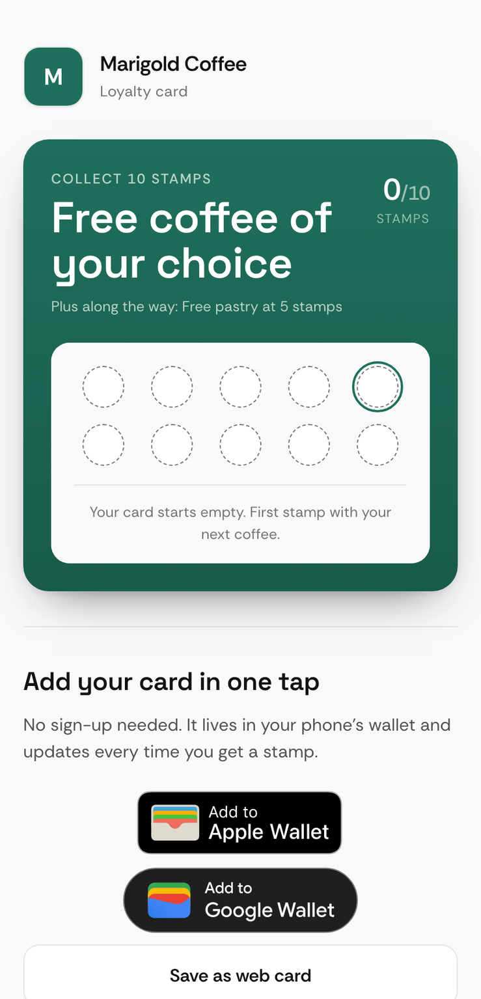
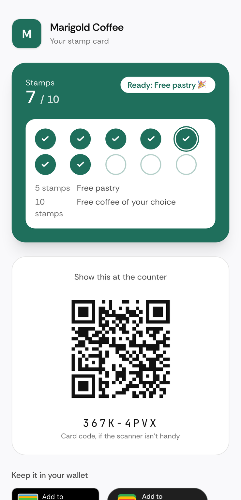
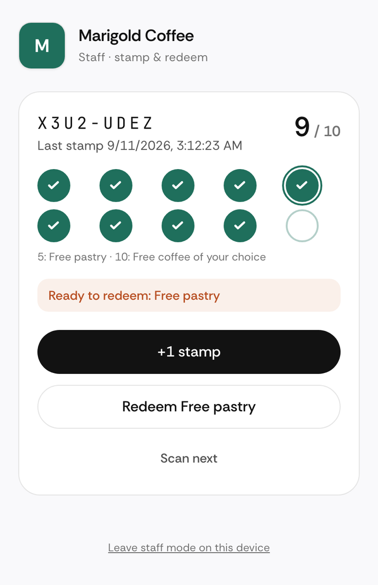
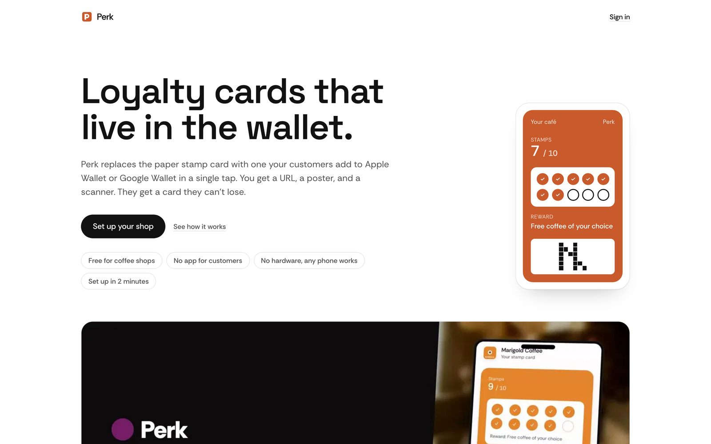
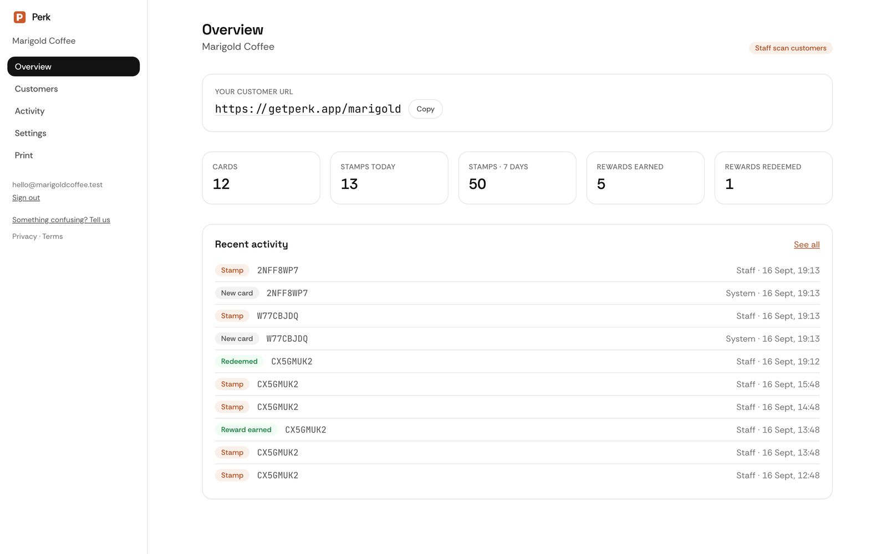
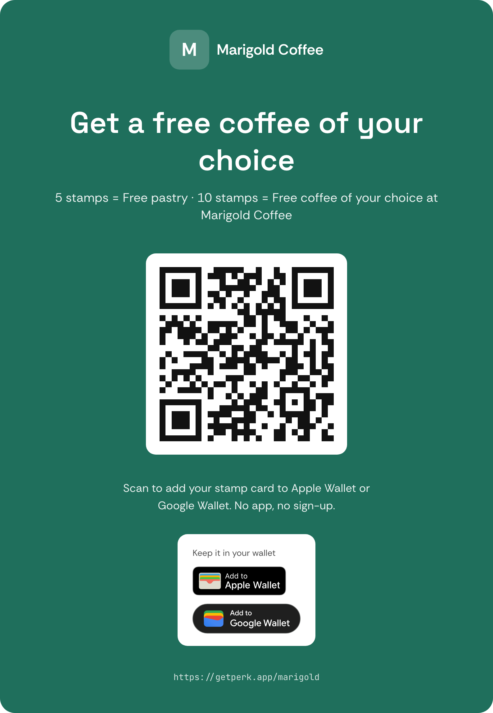

<div align="center">

# ☕ Perk

**Digital loyalty stamp cards for coffee shops — delivered to Apple Wallet and Google Wallet.**

[**Live app →** getperk.vercel.app](https://getperk.vercel.app) · [Watch the 50-second teaser](https://youtube.com/shorts/dtcs-cNDu7k)

[](https://youtube.com/shorts/dtcs-cNDu7k)

</div>

---

A shop signs up with a magic link, configures its card (logo, colour, stamps, reward, stamping mode), and gets a URL like `getperk.vercel.app/your-shop`. Customers open that link, tap once, and the card is in their wallet — no app, no account. Baristas scan the pass to stamp and redeem; passes update live on the customer's phone via APNs and the Google Wallet API. Owners get a dashboard with counters, a customer list with manual adjustments, an activity ledger, and printable counter posters.

Built for a real café in New Zealand — and free for any shop to use. If there's enough interest it stays free and keeps growing.

## Screenshots

| Customer landing | Web card | Staff scanner |
|:---:|:---:|:---:|
|  |  |  |

| Marketing site | Owner dashboard | Printable poster |
|:---:|:---:|:---:|
|  |  |  |

## How it works

- **Shops** sign in with a magic link (Auth.js + Resend), run a 2-minute onboarding, and print an A4 poster with their QR.
- **Customers** scan the poster → one tap adds the card to Apple Wallet, Google Wallet, or a web card. Cards are anonymous; an optional email backs them up.
- **Staff** open a PIN-gated scanner on any phone: scan the pass (or type its short code), tap **+1 stamp** or **Redeem**. Every stamp is pushed to the customer's wallet pass within seconds.
- Shops can instead choose **customer self-scan**: a signed static QR that customers scan after buying, with a per-card cooldown.
- Every stamp, reward, redemption and adjustment is an append-only event with a source and timestamp — a ledger, not a counter.

## Stack

Next.js 16 (App Router) · React 19 · Tailwind 4 · Drizzle ORM + Postgres (Supabase in prod, `@electric-sql/pglite` in tests) · Auth.js v5 magic links via Resend · `passkit-generator` + APNs for Apple Wallet · Google Wallet Objects API · Supabase Storage for logos · Vitest · Playwright.

- Design spec: [`docs/superpowers/specs/2026-08-31-perk-v1-design.md`](docs/superpowers/specs/2026-08-31-perk-v1-design.md)
- Implementation plan: [`docs/superpowers/plans/2026-08-31-perk-v1.md`](docs/superpowers/plans/2026-08-31-perk-v1.md)
- Manual test checklist: [`docs/manual-testing.md`](docs/manual-testing.md)

## Local development

```bash
npm install
cp .env.example .env            # fill in DATABASE_URL at minimum
npm run db:migrate              # applies drizzle/ migrations
npm run dev                     # http://localhost:3000
```

- **Database:** any Postgres works locally (`brew install postgresql@17 && brew services start postgresql@17 && createdb perk`). For Supabase use the *Transaction pooler* URL (port 6543); the client already sets `prepare: false`.
- **Email:** leave `AUTH_RESEND_KEY` empty and magic links / card-backup links are printed to the dev server console.
- **Wallets:** keep `WALLET_DRY_RUN=1` locally. Apple routes return the unsigned `pass.json`, Google/APNs calls are logged instead of sent. The web card works fully.
- **Logos:** need `SUPABASE_URL` + `SUPABASE_SERVICE_ROLE_KEY` and a public bucket named `logos`.

## Tests

```bash
npm test          # Vitest — domain, queries, security, wallet builders (in-memory Postgres via pglite)
npm run typecheck # next typegen && tsc
npm run e2e:seed && npm run e2e  # Playwright smoke test against the dev server
```

## Wallet setup

### Apple Wallet
1. In the Apple Developer portal create a **Pass Type ID** (e.g. `pass.app.perk.card`) and a certificate for it. Export the cert + private key as PEM; download Apple's **WWDR G4** intermediate.
2. Create an **APNs Auth Key** (`.p8`) — used to tell devices a pass changed.
3. Base64-encode each PEM into `APPLE_PASS_CERT_PEM`, `APPLE_PASS_KEY_PEM`, `APPLE_WWDR_PEM`, `APNS_KEY_PEM`. Set `APPLE_TEAM_ID`, `APPLE_PASS_TYPE_ID`, `APNS_KEY_ID`, `APNS_TEAM_ID`.
4. `NEXT_PUBLIC_APP_URL` must be public HTTPS — passes embed `${APP_URL}/api/wallet/apple` as their web service.

### Google Wallet
1. Create a Google Cloud project, enable the **Google Wallet API**, create a service account and JSON key.
2. In the [Google Pay & Wallet Console](https://pay.google.com/business/console) create an issuer account and invite the service account as a Developer under **Users**. New issuers start in **demo mode** until Google approves publishing.
3. Set `GOOGLE_WALLET_ISSUER_ID`, `GOOGLE_WALLET_SA_EMAIL`, `GOOGLE_WALLET_SA_KEY_PEM` (base64 of the key's `private_key` field).

## Deploy (Vercel)

Import the repo, set every variable from `.env.example` (unset `WALLET_DRY_RUN`), and point `DATABASE_URL` at Supabase's transaction pooler. Run migrations against the production database once. Native modules (`sharp`, `@resvg/resvg-js`, `passkit-generator`) are already marked as server externals in `next.config.ts`.

## Project layout

```
app/            routes — (marketing), login, onboarding, dashboard/*, [slug]/{card,scan,staff}, api/*
lib/db          Drizzle schema, client, queries (every function takes shopId first)
lib/domain      card lifecycle: create / stamp / redeem / adjust — transactional, event-sourced
lib/wallet      WalletProvider interface; apple.ts (+ apns.ts), google.ts, strip-image.ts
lib/security    HMAC scan tokens, staff cookie signing, DB-backed rate limits, short codes
components/     UI primitives, StampGrid, QR, wallet buttons
drizzle/        SQL migrations · tests/ Vitest · e2e/ Playwright
```
